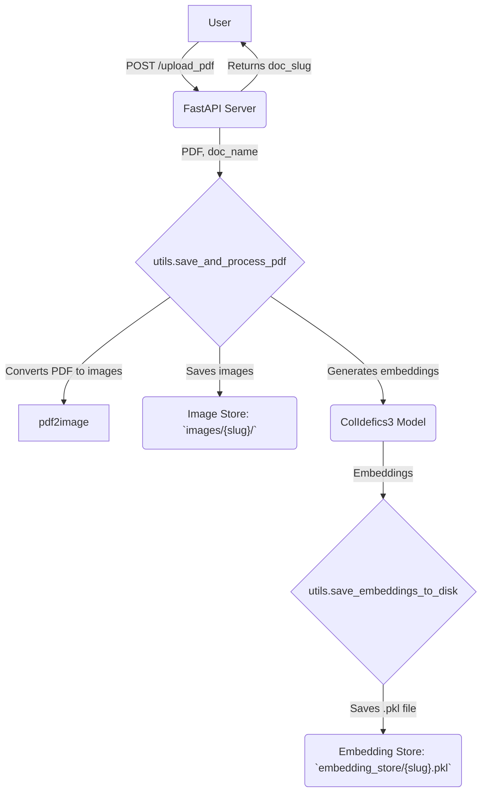
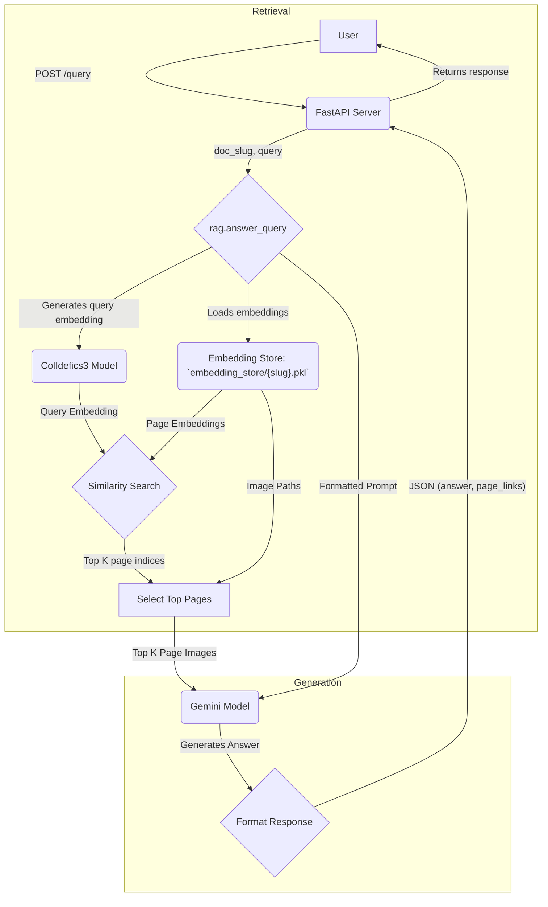

# Adapteach RAG

This project implements a Retrieval-Augmented Generation (RAG) system designed to answer questions about PDF documents. It leverages a multi-modal embedding model to understand both text and images within the PDF pages, providing contextually relevant answers generated by a large language model.

## Architecture

The application consists of a FastAPI backend that exposes two main endpoints: one for uploading and processing PDFs, and another for answering queries about them. The system uses a `ColIdefics3` model for generating multi-modal embeddings and Google's `Gemini` for generating answers.

Here is a diagram illustrating the two main workflows:

### 1. PDF Processing and Indexing



### 2. Query Answering



## How It Works

### PDF Processing
1.  **Upload**: A user uploads a PDF file and provides a document name via the `/upload_pdf` endpoint.
2.  **Conversion**: The PDF is converted into a series of JPG images, one for each page. These images are stored in the `images/{slug}/` directory, where `slug` is a URL-friendly version of the document name.
3.  **Embedding**: The `ColIdefics3` multi-modal model processes these images to generate vector embeddings for each page.
4.  **Storage**: The file paths of the page images and their corresponding embeddings are saved to a pickle (`.pkl`) file in the `embedding_store/` directory. This allows for quick retrieval without reprocessing the PDF.

### Query Answering
1.  **Query**: A user submits a question and a document slug to the `/query` endpoint.
2.  **Embedding**: The same `ColIdefics3` model is used to create a vector embedding of the user's query.
3.  **Retrieval**: The system loads the pre-computed page embeddings for the specified document. It then performs a similarity search between the query embedding and all page embeddings to find the most relevant pages (`top_k`).
4.  **Generation**: The selected page images, along with the original query, are passed to the `Gemini` model. It uses the content of the pages as context to generate a detailed, text-based answer.
5.  **Response**: The final response includes the generated answer and a list of links to the source page images that were used for context.

## Setup and Installation

1.  **Prerequisites**: This project uses `pdf2image`, which requires the `poppler` utility.
    *   **macOS**: `brew install poppler`
    *   **Debian/Ubuntu**: `sudo apt-get install poppler-utils`

2.  **Clone the repository**:
    ```bash
    git clone <repository-url>
    cd adapteach-rag
    ```

3.  **Create a virtual environment and install dependencies**:
    ```bash
    python -m venv venv
    source venv/bin/activate
    pip install -r requirements.txt
    ```

4.  **Set up environment variables**:
    Create a `.env` file by copying the example and add your Google API key:
    ```bash
    cp .env.example .env
    ```
    Edit the `.env` file:
    ```
    GOOGLE_API_KEY="your-google-api-key"
    PORT=8000
    default_top_k=2
    ```

## Running the Application

Start the FastAPI server using Uvicorn:
```bash
uvicorn main:app --reload
```
The application will be available at `http://127.0.0.1:8000`.

## API Endpoints

### Upload a PDF

*   **URL**: `/upload_pdf`
*   **Method**: `POST`
*   **Content-Type**: `multipart/form-data`
*   **Form Fields**:
    *   `doc_name` (string): The name of the document.
    *   `file` (file): The PDF file to upload.

**Example `curl` request**:
```bash
curl -X POST "http://127.0.0.1:8000/upload_pdf" \
     -H "Content-Type: multipart/form-data" \
     -F "doc_name=Class 10 Physics" \
     -F "file=@/path/to/your/document.pdf"
```

### Query a Document

*   **URL**: `/query`
*   **Method**: `POST`
*   **Content-Type**: `application/json`
*   **Body**:
    *   `doc_slug` (string): The slug of the document (returned by the upload endpoint).
    *   `query` (string): The question you want to ask.
    *   `top_k` (integer, optional): The number of relevant pages to use for context. Defaults to `2`. Use `-1` to use all pages.

**Example `curl` request**:
```bash
curl -X POST "http://127.0.0.1:8000/query" \
     -H "Content-Type: application/json" \
     -d '{
           "doc_slug": "class-10-physics",
           "query": "Explain Ohm's law.",
           "top_k": 3
         }'
```

## Key Dependencies

*   **FastAPI**: For building the web server.
*   **Uvicorn**: For running the FastAPI application.
*   **pdf2image**: For converting PDFs to images.
*   **Pillow**: For image manipulation.
*   **google-generativeai**: For accessing the Gemini API.
*   **torch**: For deep learning operations.
*   **slugify**: For creating URL-friendly slugs.
*   **colpali-engine**: Custom library providing the `ColIdefics3` model.
